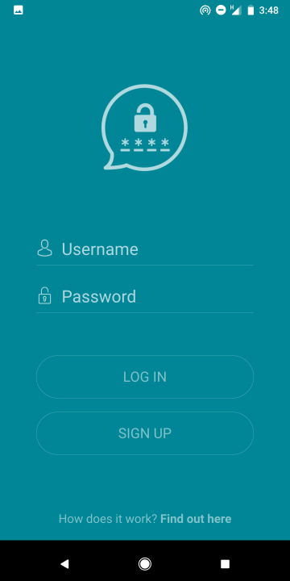
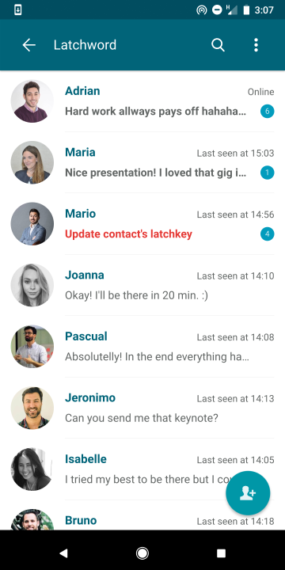
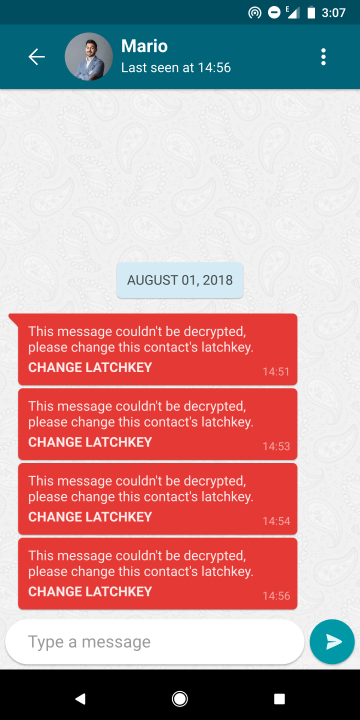
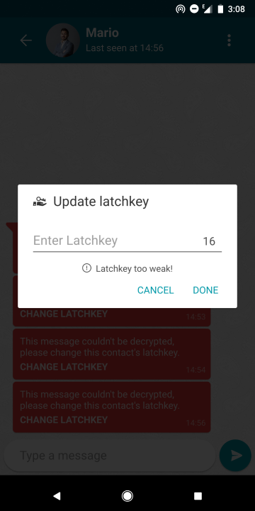
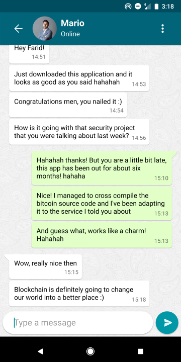
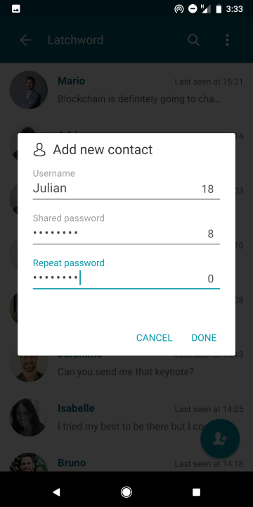

# D-Trust Messaging
The first open source cross-platform messaging app with a decentralized trust mechanism.
# Table of contents
1. [Introduction](#Introduction)
2. [Demo](#Demo)
3. [Snapshots](#Snapshots)
4. [Security mechanism](#Mechanism)
5. [Downloads](#Downloads)

## 1. Introduction
D-Trust Messaging allows you to chat in the most reliable way. It does so by using a decentralized point-to-point security mechanism on which the users are in charge of manually exchanging their own point-to-point passwords instead of depending on a centralized key exchange protocol.

The mechanism used by D-Trust solves the well known man-in-the-middle threat that nowadays leading messaging platforms have. As opposed to Whatsapp or Telegram, you can use D-Trust without even trusting on the server since it does not collaborate in the key-exchange process. In fact, users are responsible for manually creating the point-to-point keys that they will be sharing with their contacts. Henceforth, this is the most secure messaging service that can be provided to the community, aimed for entrepreneurs who need to exchange confidential information about their ideas but available for anyone to use under the common EU data privacy policy (GDPR, 20-Jul-18).

## 2. Demo

### Adding a new contact

### Conversation

### Changing profile image

## 3. Snapshots

### Loading screen while connecting to server

### Logging page

### Contact page

### Wrong latchkey

### Latchkey update

### Latchkey input

### Decrypted conversation

### Fluent conversation upon latchkey update

### Adding a new contact

### New contact added

### New contact profile

### Profile image cropping

### Personal profile

## 4. Security mechanishm
This app works with a two-layer encryption mechanishm: a point-to-server and a point-to-point layer. The point-to-server layer is intended to establish a secure channel between the server and the client wereas the point-to-point allows the clients to exchange fully encrypted messages.

### Point-to-server layer
The point-to-server layer is based on AES-128-CBC technology. Hence, it uses two pair of 16 bytes keys to send and receive data and an IV system to update these keys in order to protect against bruteforce attacks. The keys are generated while connecting to the server in the following way:

1. Once the connection is set, the client generates a purely random 16 byte nonce. This nonce is encrypted with server's public key and is sent through the network so that it can only be decrypted by the server since he's the owner of the private key.

2. Upon receipt, the server generates another random 16 byte nonce, encrypts it with AES-128-EBC using the previous nonce and sends it back to the client. At this point, each one of them shares a secret 32 byte nonce composed by the client's 16-byte long nonce and the server's 16-byte long nonce.

3. Finally, the previous nonce is turned into a client-to-server key and a server-to-client key. 

## 5. Download
[1] [Mobile version for Android](https://play.google.com/store/apps/details?id=org.qtproject.example.EncrypTalkBeta3) 
[2] [Desktop version for Windows (Unavailable, currently updating)]() 
[3] [Desktop version for Linux (Unavailable, currently updating)]() 

#### Upcoming downloads
[4] [Desktop version for MAC (Currently building)]() 
[5] [Mobile version for IOS (Currently building)]() 

###### Links for desktop version have been removed until the latest server version is fully tested. The reason for this is that proper troubleshooting will be much easier if no connections are received in the domain, therefore removing clutter from the log files. Links will be re-uploaded on August 7th once the changes are fully documentated.
