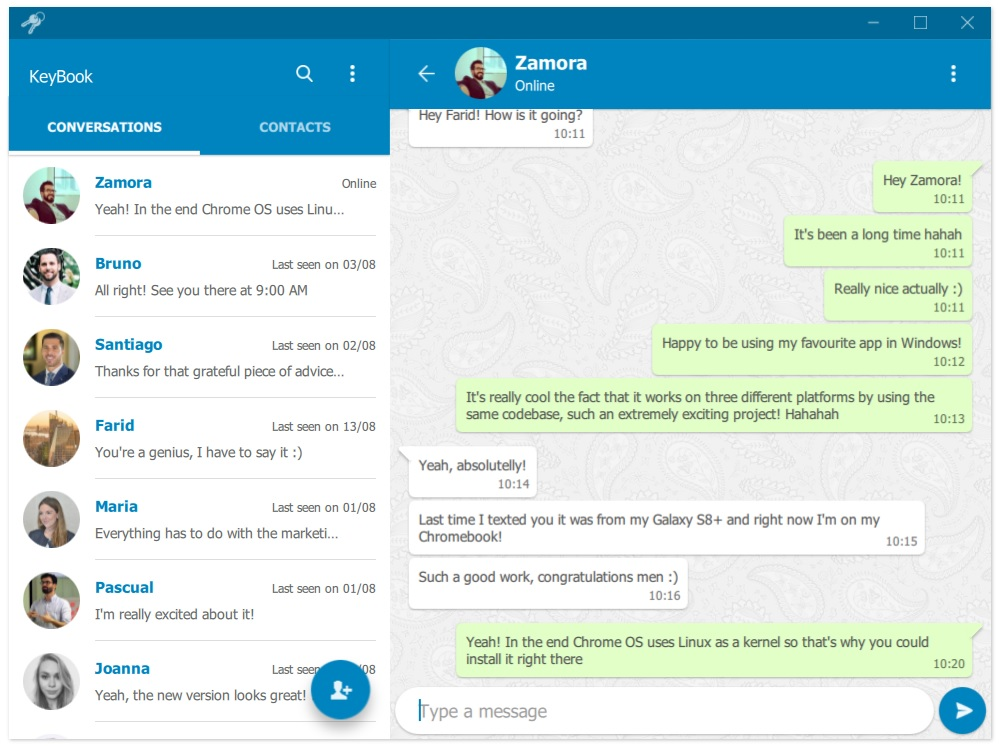

# KeyBook Messaging
> Developer : Farid Arbai
>> Website : www.faridarbai.com/keybook


## Description
Formerly called D-Trust before EU GDPR update on July 20, KeyBook Messaging is the first open source cross-platform messaging app with a decentralized trust mechanism.

### License
This project is licensed under the [GNU General Public License Version 3](LICENSE)


### Software
* CMake 3.11.3 (2018, May) [Compilation for Windows and Linux]
* Qt 5.11.1 (2018, Jul) [Graphical user interface]
* OpenSSL 1.1.1.8 (2018, Jun) [Encryption and digital signatures]
* Java SE 10 18.3 (2018, Mar) [Android bridging]
* Android SDK-27 (2017, Dec) [Android support]
* Android NDK-r16b (2017, Dec) [Compilation for Android] 


### Platforms
* Android (version 5.0+)
* Windows (7, 8/8.1 and 10)
* Linux (kernel 3.2+)


# Table of contents
1. [Introduction](#1-introduction)
2. [Demo](#2-demo)
3. [Snapshots](#3-snapshots)
4. [Security mechanism](#4-security-mechanism)
5. [Downloads](#5-download)

## 1. Introduction
KeyBook Messaging allows you to chat in the most reliable way. It does so by using a decentralized point-to-point security mechanism on which the users are in charge of managing their own point-to-point encryption keys instead of depending on a centralized key exchange protocol.

The mechanism used by KeyBook solves the well known man-in-the-middle threat that nowadays leading messaging platforms have. As opposed to Whatsapp or Telegram, you can use KeyBook without even trusting on the server since it does not collaborate in the key-exchange process. In fact, users are responsible for manually creating the point-to-point keys that they will be sharing with their contacts. Henceforth, this is the most secure messaging service that can be provided to the community at a zero cost, aimed for entrepreneurs who need to exchange confidential information about their ideas but available for anyone to use under the new EU data privacy policy (GDPR, 20-Jul-18).

## 2. Demo

[](https://www.youtube.com/watch?v=cVnN4KPDy1Y "KeyBook Messaging")

## 3. Snapshots

## Desktop version, KeyBook 7.0 (latest), August 15

### Main page


## Mobile version, KeyBook 7.0 (latest), August 15

### Contacts page


### Contact search


### Contact profile


### Contact addition


### New contact profile


### Avatar processing


### Conversation


## 4. Security mechanism
This app works with a two-layer encryption mechanishm: a point-to-server and a point-to-point layer. The point-to-server layer is intended to establish a secure channel between the server and the client wereas the point-to-point allows the clients to exchange fully encrypted messages.

### Point-to-server layer
This layer is responsible for encrypting every single message that is exchanged between the client and the server. Since this is a C-S application, all the messages are targeted to the server so for instance this layer is always active at the top of the TCP layer. It's purpose is to protect data that is directly targeted to the user management system (e.g. login credentials, profile image updates, status updates, new contact requests and so on).

The point-to-server layer is based on AES-128-CBC technology. Hence, it uses two pair of 16 bytes keys to send and receive data and an IV system to update these keys in order to protect against bruteforce attacks. The keys are generated while connecting to the server in the following way:

1. Once the connection is set, the client generates a purely random 16 byte nonce. This nonce is encrypted with server's public key and is sent through the network so that it can only be decrypted by the server since he's the owner of the private key.

2. Upon receipt, the server generates another random 16 byte nonce, encrypts it with AES-128-EBC using the previous nonce and sends it back to the client. At this point, each one of them shares a secret 32 byte nonce composed by the client's 16-byte long nonce and the server's 16-byte long nonce.

3. Finally, the previous nonce is turned into a client-to-server and a server-to-client key. To do so, the client to server key is made out by concatenating the high part of the client's nonce with the low part of the server's nonce and viceversa. Therefore, the binary formula for this keys is the following:

```C
uint16_t client_to_server = (client_nonce & 0xFF00)|(server_nonce & 0x00FF);
uint16_t server_to_client = (server_nonce & 0xFF00)|(client_nonce & 0x00FF);
```
From the previous description, it can be seen that both the client and the server contribute equally in the process of generating the point-to-server keys. This is really important in order to ensure service reliability. In fact, if the keys were only generated by the server then the client would have no clue that they're actually random and unpredictable by a third mallicious party. On the other hand, if the keys were exclusively generated by the client then a potential mallicious software on the client's device could re-install a modified version of the app in which the keys are deterministic and therefore previously known. Henceforth, parallell and mutual collaboration seems to be the right solution for the previous scenarios.

### Point-to-point layer
The point-to-point layer is what makes this app unique. Instead of relying on the world-wide used centralized point-to-point key exchange algorithms we use a distributed approach. The reason for this is the fact that in all of this legacy approaches the clients need to exchange cryptographic material at some point. Since all the messages have to pass through the server before reaching the other party , this server can perform the well-known man-in-the-middle attack that can allow him to impersonate each one of the parties involved in the exchange and therefore lead into the generation of tricky point-to-point keys as showed in the image above for the diffie-hellman user case.

<p align="center">
  
</p>

The fact that the previous attack can be performed it doesn't mean that messaging entities such as Whatsapp or Telegram take actual advantage from it, but in instance the service that they offer is absolutely exposed. In fact, if their servers were infected by a potential virus then this malware could reproduce the previous behavior and therefore decrypt all the new conversations flowing through their network.

To prevent this we built a distributed point-to-point key exchange mechanism that does not depend on the server in any way. The way in which we do that is basing on decentralized trust rather than centralized trust. This means that the trust relays now in the user's contacts rather than in the server. The way in which this is achieved is by letting the users to physically exchange their point-to-point keys by whatever means they want to. As a result, when adding a contact a user has to specify the pre-shared password, from which the point-to-point key is generated. From that point and on, all the messages are sent encrypted with that password and verified with a hash. If the hash fails, that means that one of them didn't type the password correctly, being later prompted to retype it. Therefore, with this mechanism the key exchange process is totally detached from the server so it is impossible for it to decrypt the user's conversations, providing as a consequence one of the most secure messaging platforms available for free use. 

## 5. Download
[1] [Mobile version for Android](https://play.google.com/store/apps/details?id=org.qtproject.example.EncrypTalkBeta3)<br/>
[1] [Desktop version for Windows](http://www.faridarbai.com/keybook/KeyBook_windows_universal.exe)<br/>
[1] [Desktop version for Linux](http://www.faridarbai.com/keybook/KeyBook_linux_x86_64_appimage.tar.gz)<br/>

#### Upcoming downloads
[4] [Desktop version for MAC (Currently building)]()<br/>
[5] [Mobile version for IOS (Currently building)]()<br/>

###### Links for Windows and Linux versions have been removed until August 24th while the new security architecture for them is being tested out.
